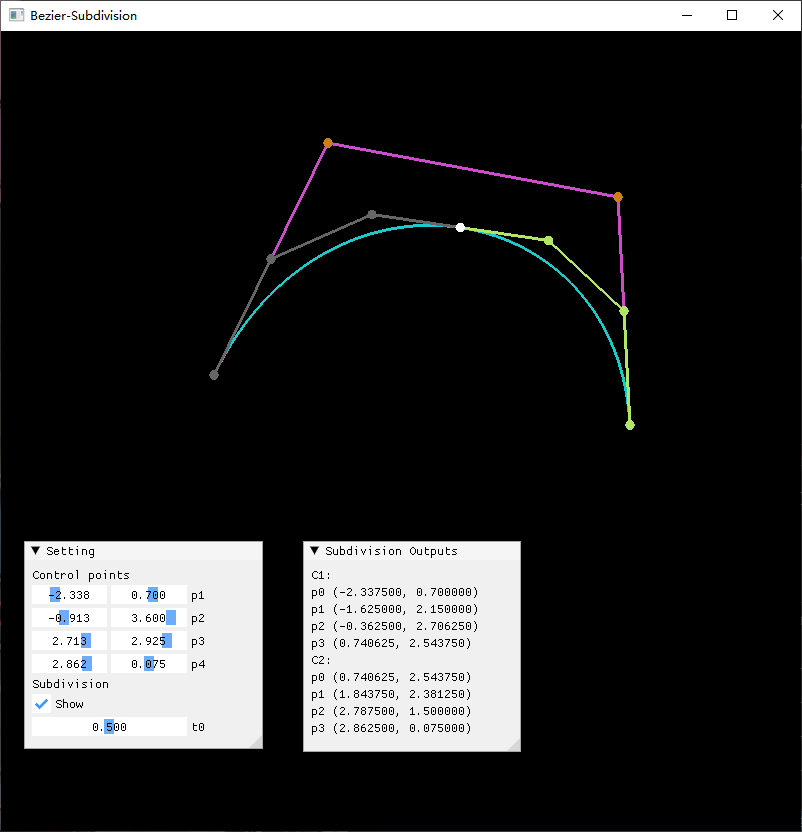

# Bezier-Subdivision

这个程序展示了三次贝塞尔曲线的分割算法。

使用了以下第三方库：
* GLFW & Glad （用于适配 OpenGL）
* glm （数学库）
* ImGui （界面库）



## 使用说明

#### 主界面
主界面显示了原 Bezier 曲线（蓝色）和其四个控制点（橙色），以及从该曲线分割出的子 Bezier 曲线和它们的控制点。注意，有些地方的控制点有所重叠，无法较好的显示。
主界面支持直接使用鼠标拖动原曲线的四个控制点，曲线和分割出的控制点也会跟随着改变。

#### Settings 窗口
`Control points` 下显示了原曲线的四个控制点的坐标数据，可以直接拖动滑动条来改变相应的数值，也可以 `Ctrl + 左键`点击滑动条来手动输入数值。
`Subdivision` 下显示的 `Show` 选项决定了是否在主界面上显示分割后的控制点，若取消勾选，则只会显示原 Bezier 曲线和四个控制点。`t0` 则是分割点的取值，在 `[0, 1]` 中取值。

#### Subdivision Outputs 窗口
这个窗口输出了分割出的2条曲线 `C1` 和 `C2` 所对应的8个控制点的具体坐标数据。


## 构建
### 使用预编译的可执行文件

预先编译好的 .exe (Windows) 可执行程序被放在 `prebuild` 文件夹下，已经进行过静态链接，（应该）可以直接打开使用。

### 使用 CMake 构建项目

```bash
mkdir build
cd build
cmake ..
make
```

若使用的是 `MinGW` ，只需将 `make` 替换为 `mingw32-make` 即可。

构建成功后，可执行文件将出现在 `build/src/Bezier-Subdivition.exe` 。