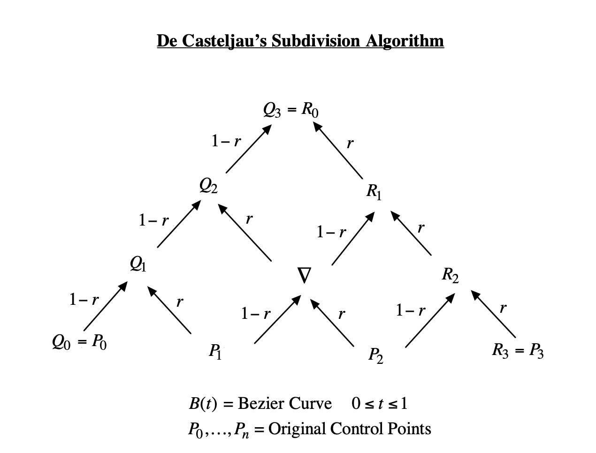

# Bezier-Subdivision

这个程序展示了三次贝塞尔曲线的分割算法。

使用了以下第三方库：
* GLFW & Glad （用于适配 OpenGL）
* glm （数学库）
* ImGui （界面库）


## 使用说明

#### 主界面
主界面显示了原 Bezier 曲线（蓝色）和其四个控制点（橙色），以及从该曲线分割出的子 Bezier 曲线和它们的控制点。注意，有些地方的控制点有所重叠，无法较好的显示。
主界面支持直接使用鼠标拖动原曲线的四个控制点，曲线和分割出的控制点也会跟随着改变。

#### Settings 窗口
`Control points` 下显示了原曲线的四个控制点的坐标数据，可以直接拖动滑动条来改变相应的数值，也可以 `Ctrl + 左键`点击滑动条来手动输入数值。
`Subdivision` 下显示的 `Show` 选项决定了是否在主界面上显示分割后的控制点，若取消勾选，则只会显示原 Bezier 曲线和四个控制点。`t0` 则是分割点的取值，在 `[0, 1]` 中取值。

#### Subdivision Outputs 窗口
这个窗口输出了分割出的2条曲线 `C1` 和 `C2` 所对应的8个控制点的具体坐标数据。


## 构建
### 使用预编译的可执行文件

预先编译好的 .exe (Windows) 可执行程序被放在 `prebuild` 文件夹下，已经进行过静态链接，（应该）可以直接打开使用。

### 使用 CMake 构建项目

```bash
mkdir build
cd build
cmake ..
make
```

若使用的是 `MinGW` ，只需将 `make` 替换为 `mingw32-make` 即可。

构建成功后，可执行文件将出现在 `build/src/Bezier-Subdivition.exe` 。

## 项目结构

主要代码存放在 `src` 文件夹下。`thirdparty` 中皆为第三方库的所需文件，不作介绍。

### `bezier.hpp`
主要的算法头文件，有三个函数。

---

```cpp
glm::vec2 calculateBezier(
    const std::array<glm::vec2, 4>& points,
    float t
)
```
`calculateBezier` 函数计算由4个控制点 `points` 控制的3次贝塞尔曲线在 `t` 处的坐标，公式如下

$\displaystyle\mathbf{B}(t) = \mathbf{P}_0(1-t)^3+3\mathbf{P}_1 t(1-t)^2+3\mathbf{P}_2 t^2(1-t)+\mathbf{P}_3 t^3, t\in[0,1]$

---

```cpp
void drawBezier(const std::array<glm::vec2, 4>& points)
```
`drawBezier` 函数渲染由4个控制点 `points` 控制的3次贝塞尔曲线和控制点。函数内使用折线来拟合贝塞尔曲线，将 `t` 从 0 到 1 分为 1000 份，分别计算出这 1000 个顶点，最后将它们连到一起，主要循环如下
```cpp
for (float t = 0.0; t <= 1.0; t += 0.001) {
    linePoints.push_back(calculateBezier(points, t));
}
```

---

```cpp
void drawSplitBezier(
    const std::array<glm::vec2, 4>& points,
    float t0,
    bool showSplit
)
```

`drawSplitBezier` 函数即是在主循环中被调用的函数，它负责调用 `drawBezier` 来渲染原贝塞尔曲线，并且将原曲线从 `t0` 开始分裂成两条子曲线，显示出两条子曲线的控制点。

分割算法如下图所示。（截图自：https://www.clear.rice.edu/comp360/lectures/old/BezSubd.pdf）



用代码实现时，可以直接跟着算法一步一步插值出结果。
```cpp
// lerp(a, b, t) = (1 - t) * a + t * b;
auto temp = lerp(points[1], points[2], t0);
c1[0] = points[0];
c1[1] = lerp(c1[0], points[1], t0);
c1[2] = lerp(c1[1], temp, t0);
c2[3] = points[3];
c2[2] = lerp(points[2], c2[3], t0);
c2[1] = lerp(temp, c2[2], t0);
c1[3] = c2[0] = lerp(c1[2], c2[1], t0);
```

### `main.cpp`

程序主入口。主要是一些初始化，ImGui的界面设置，和拖动控制点的功能。画贝塞尔曲线的主要逻辑在 `renderUpdate()` 中调用。

### `common.hpp`

公共头文件。主要是定义了一些常量、公共静态变量和 Shader 相关的结构体以及函数。

### `line.hpp`

这个头文件中仅包含了一个函数 `renderLine` ，用于渲染由 n 个顶点连接而成的折线。
```cpp
void renderLine(
    const std::vector<glm::vec2>& points,   // 顶点坐标列表，也支持 std::array
    glm::vec3 color)                        // 颜色
```

### `circle.hpp`

这个头文件中仅包含了一个函数 `renderCircle` ，用于渲染一个由 n 个顶点组成的实心圆（其实是多边形），主要用来渲染控制点。
```cpp
void renderCircle(
    glm::vec2 center,   // 圆心坐标
    float radius,       // 半径
    uint32_t vertCount, // 细分成多少个顶点
    glm::vec3 color     // 颜色
)
```

原理是，先把一个单位圆按角度分成 `vertCount` 块，每一块角度 `angle = 360.0f / vertCount`，这样就可以算出单位圆上这个点的坐标，再根据半径和圆心来作相应的变换。

$\displaystyle\mathbf{p}_i=\mathbf{center}+\text{radius}\times(\cos(\text{angle}_i\times\frac{\pi}{180}),\ \sin(\text{angle}_i\times\frac{\pi}{180}))$

算出 `vertCount` 个顶点，将它们连在一起就形成了一个类似圆的多边形。